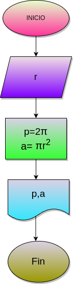

# Programa #1
Programa para calcular el area y el perimetro de un circulo de radio r

# Analisis 

## Input
### Variables de entrada
r: radio del circulo
### Processing
p=2πr
p:perimetro del circulo

a=πrr
a:Area del circulo

### output
a,p
# Diseño

# Construccion